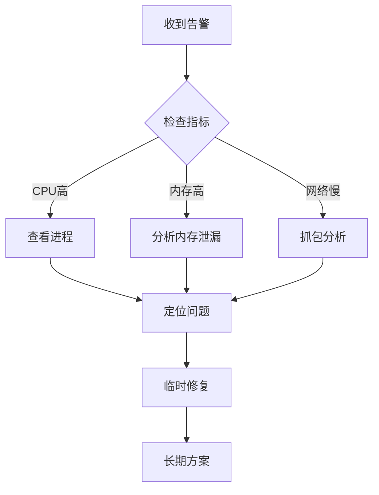
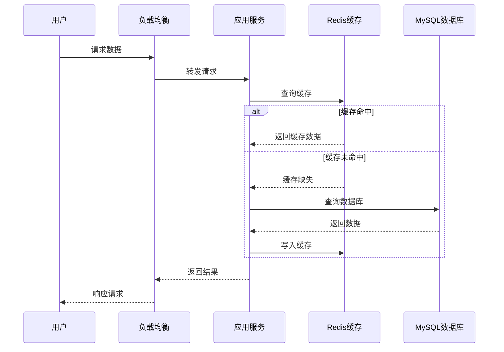
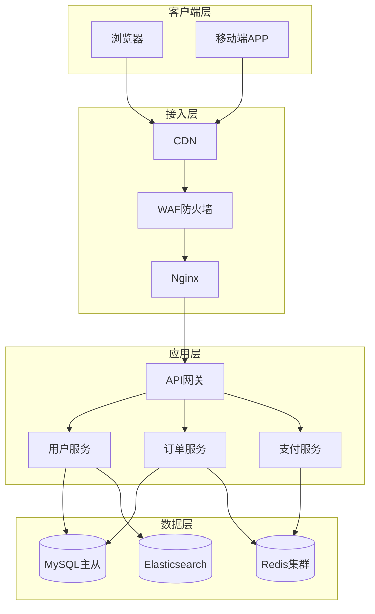
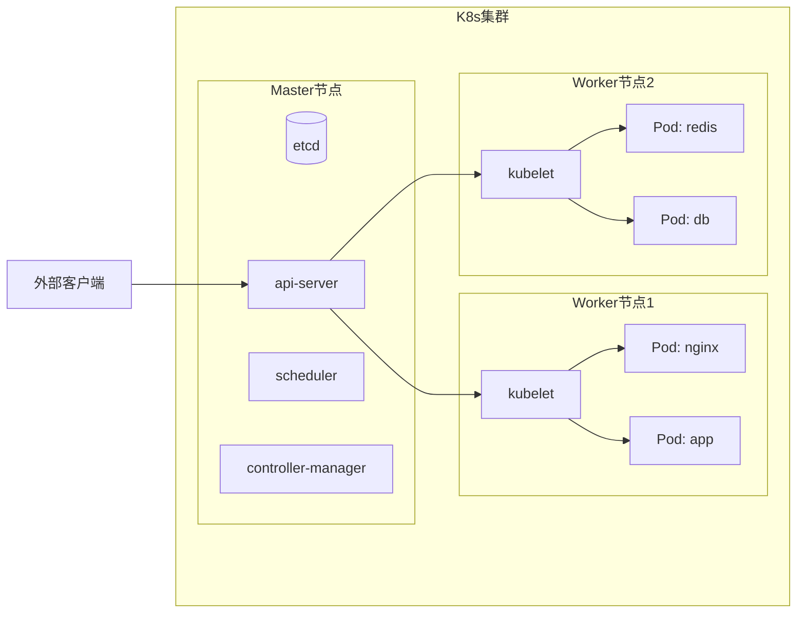
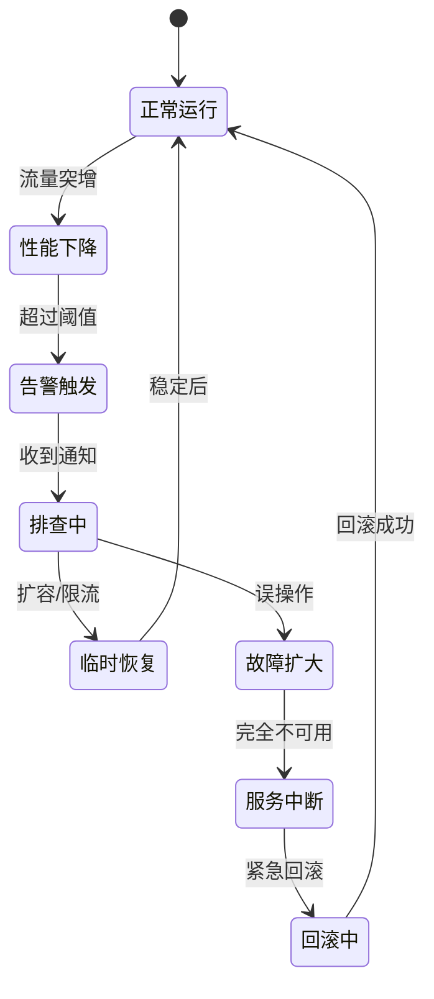
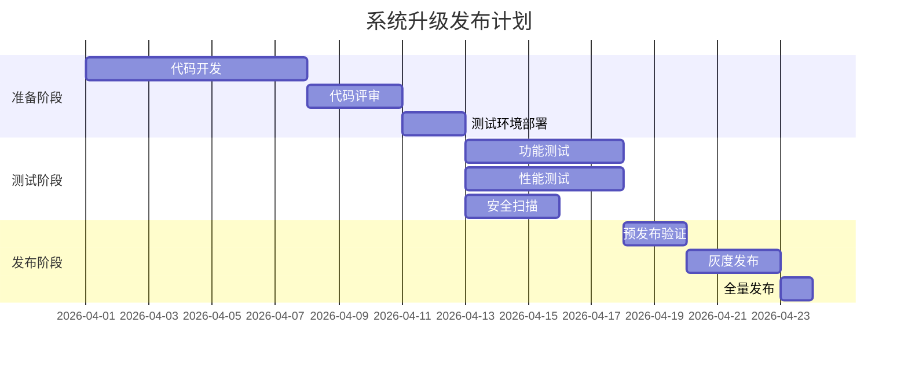
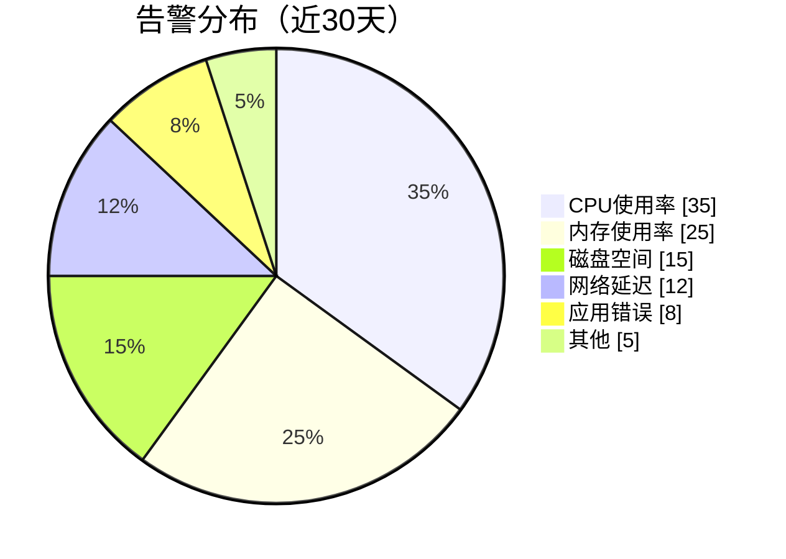

# DevOps 技术博客写作

## 工作流

### Phase 1: 理解用户需求
**输入**: 用户的博客主题或问题描述
**输出**: 明确的博客定位和目标读者

1. 确认博客类型：
   - 技术深度解析（原理 + 实践）
   - 故障复盘（问题 + 排查 + 解决 + 反思）
   - 最佳实践（经验 + 踩坑 + 总结）
   - 教程指南（从零开始的步骤）

2. 确定深度级别：
   - 入门级（概念 + 基础操作）
   - 进阶级（原理 + 进阶配置）
   - 专家级（深度优化 + 大规模实践）

3. 识别目标读者：运维工程师、开发工程师、SRE、技术管理者

#### ✅ 检查点 1：需求确认
在开始写作前，先向用户确认：

- 如果用户没有明确说明博客类型，问："你这篇想写成技术深度解析、故障复盘、最佳实践还是教程指南？"
- 如果用户没有说明深度，问："你希望这篇偏向入门教程还是深度解析？"
- 如果用户没有说明读者，问："目标读者主要是运维还是开发？"

只有用户确认后，再进入下一阶段。

### Phase 2: 收集素材与构建叙事
**输入**: 博客主题 + 类型 + 深度
**输出**: 完整的内容大纲和关键素材

1. 提取真实场景元素：
   - 生产环境规模（节点数、Pod数、QPS）
   - 具体的时间线和故障现象
   - 排查过程中的弯路和误判
   - 数据支撑（监控截图、日志片段、性能指标）

2. 构建叙事线：
   - **问题背景**: 当时遇到了什么困难
   - **探索过程**: 尝试了哪些方案，为什么失败
   - **最终方案**: 怎么解决的，为什么选这个
   - **得失反思**: 学到了什么，以后怎么避免

3. 准备代码/配置示例：
   - 包含注释，解释关键参数
   - 标注哪些是生产环境真实在用的
   - 注明版本依赖和环境要求

4. 设计图表（用 Mermaid）：
   - 识别哪些地方需要画图（架构、流程、时序）
   - 准备 Mermaid 代码（见下文「Mermaid 图表模板」）

#### ✅ 检查点 2：素材确认
如果用户没有提供足够的真实细节：

- 问："这个主题你有真实实践经验吗？有的话可以分享一些细节，比如生产环境规模、具体时间线、排查过程中的弯路等"
- 如果用户确实没有细节，可以继续，但要在文章开头注明："本文基于常见场景整理，建议结合你的真实经验补充细节"

只有用户确认后，再进入下一阶段。

### Phase 3: 撰写正文
**输入**: 内容大纲 + 关键素材
**输出**: 完整的博客初稿

按以下结构撰写：

#### 1. 标题
- 准确反映内容，不做标题党
- 包含核心关键词（如：Kubernetes、内存泄漏、故障排查）
- 建议格式：「主题 + 核心动作/结果」

#### 2. 引言（3段以内）
- **背景**: 这个技术/问题在什么场景下出现
- **痛点**: 不解决会有什么麻烦
- **目标**: 读完这篇你能学会什么

#### 3. 主体部分
分章节，每章有明确小标题：

**技术解析类**:
- 概念解释（用类比帮助理解）
- 工作原理（配流程图或架构图）
- 实际应用场景
- 配置/代码示例（带注释）
- 常见坑和注意事项

**故障复盘类**:
- 故障现象（时间、影响范围、告警）
- 排查过程（先查了什么，后查了什么，关键转折点）
- 根因分析（到底是什么导致的）
- 解决方案（临时止血 + 长期根治）
- 经验总结（怎么预防，监控怎么加）

💡 **提示**: 完整模板可参考 `references/blog-template.md`

**在合适的位置插入 Mermaid 图表**：
- 描述系统架构时 → 架构图
- 描述请求流转时 → 序列图
- 描述排查步骤时 → 流程图
- 描述部署拓扑时 → 节点图

#### 4. 总结（1-2段）
- 回顾核心要点
- 给出下一步建议（可以学什么，可以怎么实践）

### Phase 4: 语言润色与去AI化
**输入**: 博客初稿
**输出**: 最终发布版本

执行以下检查和修改：

#### 1. 替换"AI味"词汇
| 不要用 | 改用 |
|--------|------|
| 掌握 | 学习 |
| 极大地/戏剧性地 | 大大/明显 |
| 基本 | 简单/直接 |
| 重要的一点/本质是 | 记住/关键在于 |
| 为了真正理解 | 我们来看 |
| 这很关键 | 这常让人困惑 |
| 值得注意的是/重要的是要记住 | （直接删除） |
| 为了 | 要 |
| 由于……的事实 | 因为 |
| 归根结底/当谈到 | （直接删除） |
| 在本节中，我们将…… | （直接开始） |
| 如前所述 | （自然衔接） |

#### 2. 调整语气更像人说话
- 用"我"或"我们"分享经验："当时我排查了很久才发现..."
- 加入一些情绪词："这个问题坑了我好几天"、"当时真是松了一口气"
- 用口语化连接词："话说回来"、"这里插一句"、"你可能会问"
- 适当用反问引导思考："你猜问题出在哪？"

#### 3. 删除空洞修饰词
删掉：非常、极其、特别、真的、实际上、基本上、本质上、有趣的是、事实上

具体化：不说"非常快"，直接说"快"；不说"基本原理"，直接说"原理"

#### 4. 调整强调句式
| 不要用 | 改用 |
|--------|------|
| 关键点是： | 记住： |
| 重要的是： | 小心： |
| （强调） | 一个技巧： |
|  | 别忘了： |
|  | 注意这个模式： |
|  | 这里的诀窍是： |
|  | 一个好习惯是： |
|  | 想想看： |
|  | 可以这样理解： |

### Phase 5: 最终检查
**输入**: 润色后的博客
**输出**: 确认可发布

检查清单：
- [ ] 所有代码块用 ```语言类型 包裹
- [ ] 引用内容用 > 引用内容
- [ ] 标题层级正确（# ## ###）
- [ ] 没有明显的AI生成痕迹
- [ ] 内容来自真实实践（有具体细节支撑）
- [ ] 长度在 2000-4000 字之间
- [ ] 既有实操步骤，又有原理分析

## 核心原则（时刻牢记）

### 真实高于完美
所有内容必须来源于真实生产环境经验。不要写"理想环境下的完美方案"，要写"实际运行过、踩过坑、经过改进"的真实案例。

### 讲"为什么"不只是"怎么做"
不要只罗列命令和配置。要解释：
- 为什么选这个方案而不是那个
- 这么做有什么 trade-off
- 什么情况下会出问题
- 出了问题怎么排查

### 不回避失败
故障复盘是最有价值的内容。大方分享：
- 当时的误判和弯路
- 哪里最容易踩坑
- 事后看怎么可以做得更好

### 长期主义视角
不仅关注短期性能，更关注：
- 系统半年、一年、三年后会怎样
- 维护成本会不会越来越高
- 新人能不能快速上手

## 边界条件与回退

### 遇到这些情况时调整策略

#### 1. 用户没有具体细节
**症状**: 用户只说"写一篇 K8s 故障排查"，但没有提供任何真实场景
**处理**:
- 用通用框架，但要在文章开头注明："本文基于常见场景整理，建议结合你的真实经验补充细节"
- 主动询问用户能否提供一些细节

#### 2. 主题太大太泛
**症状**: 用户说"写一篇 DevOps 最佳实践"，范围太广
**处理**:
- 主动缩小范围，建议："这个主题挺大的，我们可以聚焦在某个具体场景来写，比如 CI/CD 最佳实践、监控告警最佳实践，你看哪个更合适？"
- 如果用户坚持写大而全的，可以写，但要提醒："这个范围比较广，我们先写一个框架，后续你可以再补充细节"

#### 3. 纯理论研究
**症状**: 用户要写"Kubernetes 调度算法原理深度解析"，纯理论没有实践
**处理**:
- 说明："这个skill更适合写实践经验，纯理论可能需要其他方式"
- 如果用户坚持，可以写，但要补充一些实际应用场景的例子

#### 4. 用户要求的内容与 skill 定位不符
**症状**: 用户要写一篇散文、小说或非技术内容
**处理**:
- 温和说明："这个skill主要用于写DevOps技术博客，你这个需求可能需要其他skill"
- 可以推荐其他相关skill

#### 5. 生成的博客太长或太短
**症状**: 不到1000字或超过5000字
**处理**:
- 太短：补充更多细节、例子、扩展说明
- 太长：拆分成多篇，或精简非核心内容

### 如果拿不准，问用户
- "这个主题你有真实实践经验吗？有的话可以分享一些细节"
- "你希望这篇偏向入门教程还是深度解析？"
- "目标读者主要是运维还是开发？"
- "这个范围可以吗？要不要再聚焦一些？"

## Mermaid 图表模板

DevOps 博客常用的 Mermaid 图表示例，直接复制使用：

### 1. 流程图（排查/部署流程）



### 2. 序列图（请求/调用链路）



### 3. 架构图（系统拓扑）



### 4. 节点图（K8s 集群）



### 5. 状态图（故障状态流转）



### 6. 甘特图（项目/发布 timeline）



### 7. 饼图（监控告警分类）



### Mermaid 使用建议
- 图表不是越多越好，只在能帮助理解的地方使用
- 保持图表简洁，避免元素过多
- 用颜色区分不同层级/组件
- 图表上方加一句简短说明，解释图表要表达什么

---

**现在开始吧**：告诉我你想写什么主题，我会按这个流程帮你写一篇高质量的 DevOps 技术博客。
